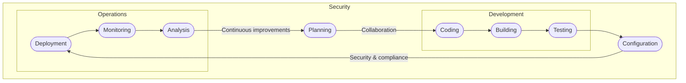

<h1 align="center">Kerig</h1>

<h3 align="center">Keep it readable. Keep it maintainable. Keep it scalable.</h3>

Here at Kerig, we believe open-source technology creates **trust** and **transparency** between developers and end-users, whoever it may be. But we don't acknowledge open-source as the *only* condition for realising these relation characteristics. The source code has to be what we call *high quality*. That is, readable, maintainable and scalable.

	
Readability

	

		<blockquote>
			<h3>Keep it readable.</h3>
		</blockquote>
		
Source code readability is one of the most influential factors contributing to a project's success or failure&#8212;especially in the subtext of a company, where time is often money. Good source code readability means <i>anyone</i> proficient with the language concerned can draw a <b>concise</b> and <b>clear</b> picture of what any given chunk of code does <i>without</i> any additional context.

	

	
Maintainability

	

		<blockquote>
			<h3>Keep it maintainable.</h3>
		</blockquote>
		
Source code maintainability is just as important as source code readability. Source code maintainability refers to how easy it is to keep your project's development pace at the <i>utmost</i>. Maintainable source code can change according to the project's needs as quickly as the project changes, with as little hassle as possible.

	

	
Scalability

	

		<blockquote>
			<h3>Keep it scalable.</h3>
		</blockquote>
		
In a nutshell, scalable source code defines how easily and quickly a project can scale up. Scalable source code is written with scalability in mind from the very beginning. Overall it means that you don't have to scrap all of your source code just because the project needs to scale up and the current source code can't.

	

## Our DevSecOps

DevSecOps makes your workflow **high-performing**, results in **better** products and ultimately **greater** customer satisfaction. We try our best to incorporate this culture and practices where possible. No wonder we develop at the pace we do.

---

<h3 align="center"><a href="https://kerig.ee" target="_blank">www.kerig.ee</a> &#8226; <a href="mailto:kerigit@outlook.com" target="_blank">kerigit@outlook.com</a> &#8226; <a href="https://twitter.com/kerig_it" target="_blank">@kerig_it</a></h3>
